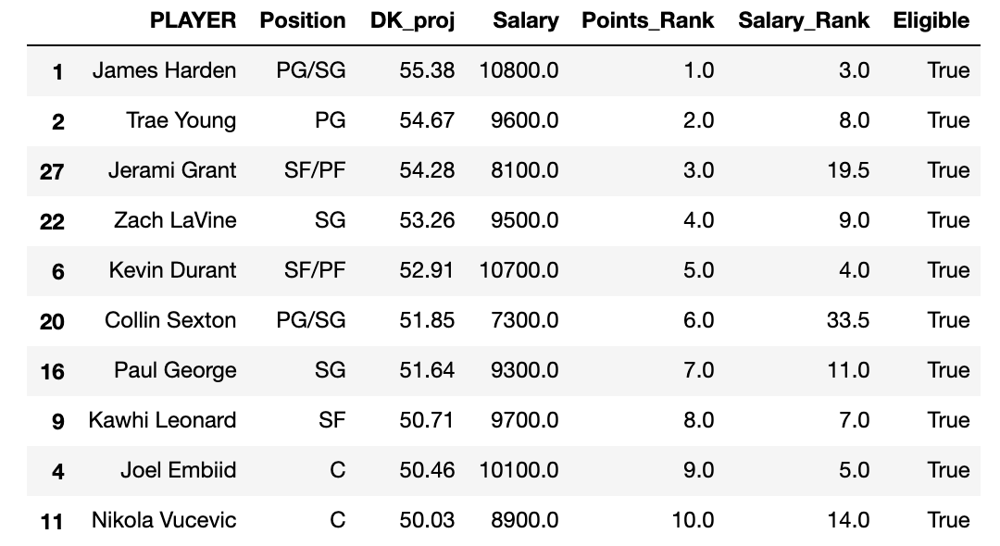

# NBA Daily Fantasy Forecaster

## Initial Background and Plan

#### The goal of this data science project is to create a model to forecast NBA player statistics. Using game-logs dating back to 2016, I will try to predict the statistics of each player for an upcoming game and use the predictions to create an optimal lineup to be played in daily fantasy.

#### DraftKings/FanDuel daily fantasy games are contests that have the user choose 5 players that they think will have the most fantasy points on any given night. If your team scores the most fantasy points, you win cash prizes. The catch is that there is a salary cap when choosing the players (so you cannot simply choose the best players every night). My model will try to find the undervalued players (based on their draftkings salary).

#### My data was collected from stats.nba.com. I webscraped the game logs dating back to 2016 with a function and was able to collect over 100,000 game logs total. These game logs will be my initial inputs into the model to predict the player's next game statistics. I also created a function that scrapes the advanced stats of the opposing team's defense (if a player is playing against a better defense, maybe they won't score as well). Further, I scraped data about the rest days of each team from the previous 3 seasons. For example, how the team did when playing in back to back nights, or how they did when they played 2 games in 3 days. Putting all this together, I will create an ARIMA model to predict individual statistics on a given night. 

